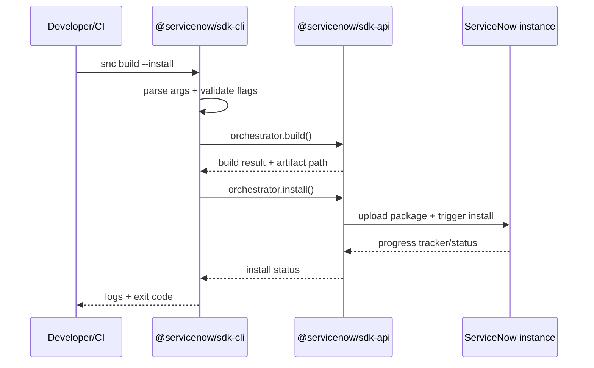

# Deep Dive: `@servicenow/sdk-cli` (v4.5.0)

`@servicenow/sdk-cli` is the command interface layer for the ServiceNow SDK stack. It translates developer intent (`snc build`, `snc deploy`, `snc init`, `snc types`) into orchestrated calls into `@servicenow/sdk-api` and build subsystems.

## Package Identity

| Field | Value |
|---|---|
| Name | `@servicenow/sdk-cli` |
| Version | `4.5.0` |
| License | `MIT` |
| Main entry | `dist/index.js` |
| TypeScript declarations | `./dist/index.d.ts` |
| Unpacked size | 293,250 bytes (~286.4 KB) |
| File count | 122 |
| Node.js required | `>= 20.18.0` |
| Package manager | `pnpm >= 10.8.0` |

## What It Owns

At a high level, `sdk-cli` owns:

- Command parsing and routing
- Argument validation and UX prompts
- Human-readable logging and error display
- Authentication/session handoff flows
- Invocation of API/build operations in `sdk-api`

It does **not** implement deep metadata compilation itself. Compiler-heavy transforms live in `@servicenow/sdk-build-core` and plugins.

## Core Responsibilities

### 1) Command Routing

Typical command flow:

1. Parse argv
2. Resolve command + options
3. Validate/normalize inputs
4. Create context/config
5. Call `sdk-api` orchestration methods
6. Render terminal output + exit code

### 2) UX + Interaction Layer

- Interactive prompt mode for guided operations
- Non-interactive mode for deterministic CI pipelines
- Actionable flag and runtime error output

### 3) Diagnostics Presentation

- Structured logs for each command phase
- Contextual error messages with hints
- Stable CLI output patterns across local and CI environments

### 4) Auth Integration

The CLI resolves command intent and auth mode, then delegates instance-facing operations to API-layer abstractions.

## Runtime Dependencies (`4.5.0`)

| Dependency | Version | Why it matters |
|---|---|---|
| `@servicenow/sdk-api` | `4.5.0` | Core lifecycle orchestration calls |
| `@servicenow/sdk-build-core` | `4.5.0` | Build primitives consumed by commands |
| `yargs` | `17.6.2` | CLI argument parsing |
| `winston` | `3.8.2` | Structured command logging |
| `chalk` | `4.1.2` | Terminal styling |
| `@inquirer/prompts` | `3.1.1` | Interactive prompts |
| `openid-client` | `5.6.5` | OAuth/OIDC flows |
| `@napi-rs/keyring` | `1.2.0` | Secure credential storage bridge |
| `clipboardy` | `4.0.0` | Clipboard convenience for UX flows |
| `tough-cookie` | `5.1.2` | Cookie/session management |
| `lodash` | `4.17.23` | Utilities |
| `semver` | `7.5.4` | Version constraint handling |
| `open` | `8.4.2` | Opens browser for auth and docs flows |

## Architecture Position

```text
Developer / CI
   │
   ▼
@servicenow/sdk-cli
   ├── parse command + flags
   ├── validate and normalize inputs
   ├── render logs/prompts/errors
   └── call orchestration methods
           ▼
      @servicenow/sdk-api
           ▼
   build core / plugins / connector / instance APIs
```

## UML: Command Execution Sequence



## Notes for Teams

- Pin SDK versions in CI for deterministic command behavior.
- Prefer non-interactive flags in automation.
- Treat CLI output as human-facing unless a machine-readable output mode is explicitly provided.

## Source References

- `https://www.npmjs.com/package/@servicenow/sdk-cli`
- `https://registry.npmjs.org/@servicenow%2Fsdk-cli`

## Tarball Evidence (from docs/npm-packs/extract)

- package.json highlights:
  - `main: dist/index.js`
  - `engines.node: ">=20.18.0"`
  - dependencies include `yargs@17.6.2`, `winston@3.8.2`, `chalk@4.1.2`, `@inquirer/prompts@3.1.1`, `openid-client@5.6.5`, `@servicenow/sdk-api@4.5.0`, `@servicenow/sdk-build-core@4.5.0`
- dist layout (selected):
  - `dist/index.js`
  - `dist/command/{auth,build,clean,dependencies,download,explain,init,install,move-to-app,pack,run,transform,upgrade}/index.js`
  - `dist/logger/`, `dist/usage/`, `dist/telemetry/`, `dist/auth/`

### Node engine guard and yargs setup (excerpt)

```js
// dist/index.js (excerpt)
const yargs = require('yargs')
const { usage } = require('./usage')
const { epilogue } = require('./epilogue')
const { build } = require('./command/build')
const { install } = require('./command/install')
const { download } = require('./command/download')
const { transform } = require('./command/transform')
const { init } = require('./command/init')
const { auth } = require('./command/auth')
const { pack } = require('./command/pack')
const { explain } = require('./command/explain')
const { clean } = require('./command/clean')
const { dependencies } = require('./command/dependencies')
const { satisfies } = require('semver')
const { logger } = require('./logger')
const pkg = require('../package.json')

yargs
  .check(() => {
    const needed = pkg.engines.node
    if (!satisfies(process.version, needed)) {
      logger.error(`now-sdk requires node version to be ${needed}`)
      process.exit(1)
    }
    return true
  })
  .usage(usage)
  .option('debug', { alias: 'd', type: 'boolean', default: false })
  .command(auth)
  .command(init)
  .command(download)
  .command(build)
  .command(install)
  .command(dependencies)
  .command(transform)
  .command('run [script]', false, require('./command/run').run)
  .command(clean)
  .command(pack)
  .command(explain)
  .command('move', false, require('./command/move-to-app').moveToApp)
  .demandCommand()
  .epilogue(epilogue)
  .strictCommands()
  .help()
  .scriptName('now-sdk').argv
```

### `snc build` command builder (excerpt)

```js
// dist/command/build/index.js (excerpt)
exports.build = {
  command: 'build [source]',
  describe: 'Compile sources into app files and generate installable package',
  builder: (yargs) => yargs
    .positional('source', { describe: 'Path to project', default: process.cwd(), type: 'string' })
    .option('frozenKeys', { describe: 'Validate Keys/SysIds for CI', default: false, type: 'boolean' })
    .option('ids', { describe: 'Array of sysIds of records to build', type: 'array', string: true, hidden: true })
    .option('profile', { describe: 'Emit a .cpuprofile', type: 'boolean', default: false, hidden: true }),
  handler: async (args) => { /* orchestrator.build({ frozenKeys, sysIds }) */ }
}
```

