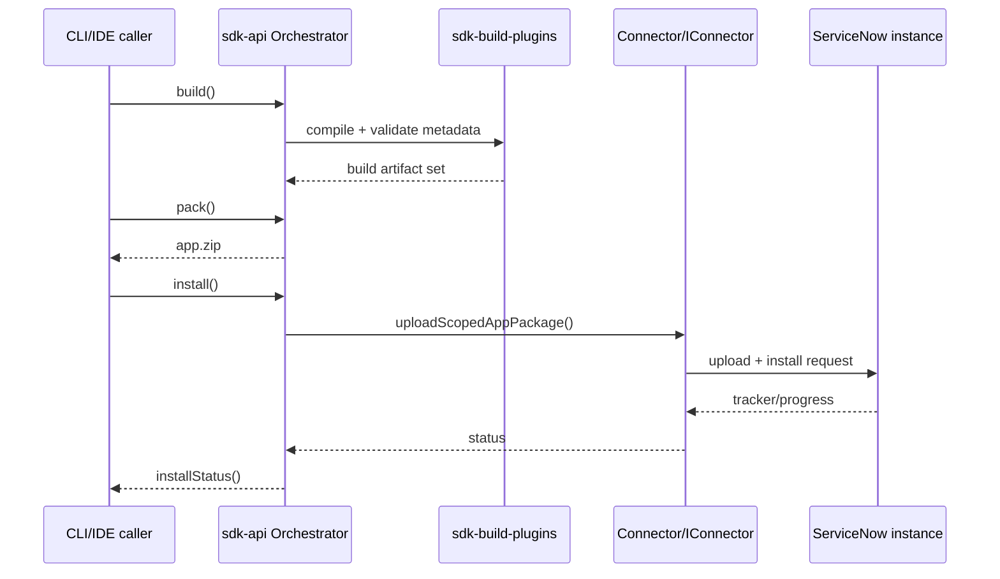

# Deep Dive: `@servicenow/sdk-api` (v4.5.0)

This is the core programmatic API layer of the ServiceNow SDK. It provides the building blocks for building, packaging, installing, and managing ServiceNow applications (scoped apps) from Node.js tooling or IDE extensions.

## Package Identity

| Field | Value |
|---|---|
| Name | `@servicenow/sdk-api` |
| Version | `4.5.0` |
| License | `MIT` |
| Main entry | `dist/index.js` |
| TypeScript declarations | Yes (built-in `.d.ts` files) |
| Unpacked size | 2.45 MB / 140 files |
| Node.js required | `>= 20.18.0` |
| Package manager | `pnpm >= 10.8.0` |

## What It Exports (`dist/index.d.ts`)

The public API re-exports from several sub-modules:

```ts
from '@servicenow/sdk-build-core'  →  Context, Plugin, Keys, Compiler, CompilerOptions, Logger,
                                       Package, File, TelemetryFactory, FileSystem, ts, tsc,
                                       Diagnostic, NowConfig
from './project'                   →  Project, TransformResult
from './project-file'              →  (project file utilities)
from './orchestrator'              →  Orchestrator (core lifecycle class)
from './project-factory'           →  ProjectFactory, templates, TemplateFile, etc.
from './context'                   →  { Parser }
from './credentials'               →  LazyCredential, Credential types
from './connector'                 →  Connector, IConnector
from './orchestrator/dependencies' →  { ApplicationDependencies }
```

## The 5 Core Modules

### 1) `Orchestrator` — The Brain

This is the central class responsible for coordinating the entire app lifecycle. It takes a `Project` and optionally a `LazyCredential` or `IConnector` in its constructor.

Key methods:

- `build(options?)` — Compiles the project, generates output files, saves the keys registry. Supports `frozenKeys` (throw on key drift) and `sysIds` (filter which records to include in output). Returns `BuildResult` (success/failure + `packOutput` path).
- `clean()` — Clears the build output and pack output directories.
- `pack(packagePath?)` — Creates a ZIP archive of the build output, ready for installation.
- `unpack(zipPath, targetPath)` — Extracts a ZIP archive of ServiceNow app files.
- `install(options?)` — Installs the app on a connected ServiceNow instance. Supports: `clean` (wipe first), `packageZipPath`, `installAsStoreApp`, `installAsync`, `demoData`, and `skipFlags`.
- `installStatus()` — Polls the status of an in-progress app upgrade (`{ finished: boolean, id: string }`).
- `download(options?, downloadPath?)` — Downloads the app's source XML from the instance. Supports four modes:
  - `complete` — full download
  - `incremental` — only changes since `lastPull`
  - `update-set` — download a specific update set
  - `sys-id` — download specific records by `sys_id`
- `transform(options?)` — Transforms metadata files (used to convert downloaded XML into project format).
- `uploadXMLFiles(filePaths, options?)` — Uploads raw XML files back to the instance (to a target update set).
- `moveToApp(options)` — Generates `sys_claim` records on the instance to claim/move global records into the scoped app.
- `types(options?)` — Downloads TypeScript type definitions from the instance. Can fetch script definitions (`glide.*.d.ts` files for server-side Glide APIs) and/or fluent types (generated from `now.config.json` dependencies).
- `addDependency(options)` — Adds dependency items to the project and updates `now.config.json`. Supports: flow actions/triggers/subflows, table definitions, or any arbitrary table records. Wildcard `*` with a scope fetches all records of that type.
- `applyTemplate(id, params?)` — Applies a code/file template to the project.
- `getDocsMetadata()` — Returns documentation metadata for all APIs from loaded plugins.

Build result types:

```ts
BuildResultSuccess = { success: true; packOutput: string; ... }
BuildResultError   = { success: false; ... }
```

Download options types (discriminated union by method):

- `DownloadCompleteOptions`
- `DownloadIncrementalOptions`
- `DownloadUpdateSetOptions`
- `DownloadIDOptions`
- `DownloadMetadataOptions`

### 2) `Connector` / `IConnector` — HTTP Communication Layer

The `Connector` class implements `IConnector` and handles all HTTP communication with a ServiceNow instance. It holds a `LazyCredential` for auth and exposes:

- `fetch(path, init?, params?)` — Core fetch to any instance subpath (e.g., `api/now/table/incident`).
- `download(scope, options?)` — Downloads scoped app XML (complete or incremental).
- `downloadUpdateSet(updateSetId, scopeId)` — Downloads a specific update set.
- `uploadScopedAppPackage(file, options)` — Uploads a ZIP package to install. Options: `timeoutMs`, `loadDemoData`, `isStoreApp`, `registerScope`, `installAsync`, optional `appInfo` (`scope`, `scopeId`, `version`). Returns `{ tracker, rollback }`.
- `uploadXmlFiles(scope, files, options?)` — Uploads raw XML files to the instance.
- `unloadRecords(sysIds, scopeId)` — Exports records as XML using the unload API.
- `unloadDependentRecords(request)` — Unloads records including their relationship graph.
- `moveToApp(sysIds, scope)` — Moves records into a scoped app.
- `uninstallApplication(scopeId, isStoreApp)` — Removes an app from the instance.
- `appUpgradeStatus(scope)` — Checks install/upgrade progress.
- `getProgress(progressId)` — Gets progress percentage + status message.
- `getUpdateMutex()` — Checks if an update is currently locked.
- `getInstanceBuildName()` — Gets the instance build name string.
- `appCreatorVendorPrefix()` — Gets the vendor prefix for the App Creator.
- `getScopeInfo(scope, scopeId)` — Gets info about a scoped app (`app`, `sysClassName`, `active`, `scope`, `name`, `shortDescription`).
- `setCurrentApplication(scopeId)` — Sets the active application context on the instance.
- `syntaxEditorCompletionDefinitions()` — Fetches TypeScript definitions for Glide server scriptables.
- `syntaxEditorCacheScriptIncludes()` — Fetches a map of script include identifiers to their `sys_id`.
- `syntaxEditorDefinitionsScriptIncludes(scriptIncludeIds)` — Fetches TypeScript definitions for specific script includes.
- `processorRequest(api, search)` — Calls a ServiceNow processor API endpoint.

Key types:

- `UnloadedRecord = { content, sysId, table, tableName, name }` — a single unloaded XML record.
- `BatchRecord`, `BatchUnloadRequest` — for batch-fetching records with their relationship graphs.
- `CustomizeOrMoveResult = { sys_id, table }` — result of a move-to-app operation.

### 3) Credentials — Auth Layer

The credentials module defines the authentication model:

- `UserTokenCredential` — basic auth via token (Base64 `user:password`) and/or cookie.
- `OAuthCredential` — OAuth2 via bearer token.
- `Credential` — union of the two above.
- `LazyCredential` — wraps an `instanceUrl: URL` and an `authResolver` function (`() => Promise<ResolvedAuth>`).

`LazyCredential` is lazy because credentials may need to be resolved asynchronously (e.g., from a user prompt or keychain). It exposes `getHeaders()` and `getSysParmCk()`.

### 4) `ApplicationDependencies` — Type Definition Management

Lives in `dist/orchestrator/dependencies/`. This class fetches and manages external dependency types that a ServiceNow project may reference.

Key capabilities:

- `configurationToScopedFetch(config)` — Converts `now.config.json`'s dependencies section into a map of `scope -> TableFetch[]` to be fetched from the instance.
- `addScriptDefinitions()` — Downloads `glide.*.d.ts` TypeScript definitions for server-side Glide APIs.
- `addFluentTypes()` — Downloads fluent (generated) TypeScript types from the instance based on `now.config.json` dependencies (e.g., table schemas, flow actions).
- `addDependencyItems(table, ids, scope)` — Transactionally fetches records from the instance, generates TypeScript type definitions for them, then updates `now.config.json`. The transactional approach ensures the config only reflects successfully installed dependencies.

Sub-components within `dependencies/`:

- `fluent-index-builder` — Builds index files for fluent type definitions.
- `fluent-type-generator` — Generates TypeScript types from ServiceNow records.
- `relationship-resolver` — Resolves record relationship hierarchies (`RelationshipHierarchy<T>`) for determining which related records to unload alongside a given record.
- `script-definition-generator` — Generates `glide.*.d.ts` type definition files.
- `tables-global-generator` — Generates type definitions for global tables.

Dependency config format (in `now.config.json`):

```json
{
  "dependencies": {
    "global": {
      "tables": ["incident", "problem"],
      "automation": { "actions": ["action_id1"] }
    },
    "x_my_app": {
      "sys_security_acl": ["acl_id1"]
    }
  }
}
```

### 5) `ProjectFactory` — Project Scaffolding

Used to create and initialize new ServiceNow projects.

Key methods:

- `createProjectFromApp(workingDir, scopeId, connector, options)` — Creates a project by pulling an existing app's structure from the instance.
- `createConfigurationProject(workingDir, connector, scopeOptions, options)` — Creates a configuration-type project.
- `createProjectFromDirectory(workingDir, metadataDir, options)` — Creates a project from an existing directory of metadata files.
- `createProject(workingDir, options)` — Creates a brand-new project from `InitOptions` (`name`, `scope`, `packageName`, `description`, `sdkVersion`, etc.).
- `getProjectTemplates(query?)` — Lists available code templates, filterable by label.
- `getPartialTemplates()` / `getFullTemplates()` — Returns subsets of templates.
- `static createNpmPackageName(appName)` — Derives an npm-friendly package name from a ServiceNow app name.
- `ProjectInitValidation` — Validates init options, app names, scope names, and npm package names.
- `renderTemplates(templates, data, originalFiles)` — Renders template files using Handlebars with provided data. Returns `RenderedTemplateFile[]` (template content + original file reference for conflict detection).
- `wouldTemplateConflict(templateContent, existingContent, newContent)` — Checks if applying a template would produce a conflict.

## `context/` — Build Context & Parsing

The context module is what plugin code runs inside during the build. It exposes:

- `Parser` — The main export, used to parse ServiceNow metadata files.
- `Factory` (implements `IFactory`) — Creates `Record` and `RecordId` objects from source metadata, with properties like `source`, `explicitId`, `table`, `action`, `installCategory`.
- `Committer` — Commits built records to output.
- `Diagnostics` — Manages build-time diagnostics/errors.
- `Keys` — Manages the keys registry (a stable mapping of record references).
- `Inspector` — Inspects built output.

## Dependencies Explained

The package's runtime dependencies tell you a lot about what it does under the hood:

| Dependency | Purpose |
|---|---|
| `@servicenow/isomorphic-rollup` | Universal module bundling (works in Node.js + browser) |
| `@servicenow/sdk-build-core` | Core build types & abstractions (`Plugin`, `Context`, `FileSystem`, etc.) |
| `@servicenow/sdk-build-plugins` | Official build plugins (TypeScript compilation, etc.) |
| `crypto-js` | Cryptography (likely for credential token hashing) |
| `fast-json-stable-stringify` | Deterministic JSON serialization (for cache keys/hashes) |
| `fast-xml-parser` | Parses ServiceNow XML metadata unload files |
| `handlebars` | Template rendering (for `ProjectFactory` / `renderTemplates`) |
| `lodash` | General utility functions |
| `zod` | Runtime schema validation (validates `now.config.json`, API responses, etc.) |

## Architecture Summary

```text
@servicenow/sdk-api
│
├── Orchestrator                  ← Lifecycle coordinator (build/pack/install/download/types)
│   ├── → Project                 ← Project model (paths, config, file system)
│   ├── → Connector               ← HTTP client for the ServiceNow instance
│   └── → ApplicationDependencies ← Type definition management
│       ├── FluentTypeGenerator       ← Generates TS types from record data
│       ├── ScriptDefinitionGenerator ← Downloads glide.*.d.ts
│       ├── RelationshipResolver      ← Resolves record dependency graphs
│       └── FluentIndexBuilder        ← Maintains @types index files
│
├── Connector / IConnector        ← HTTP layer (fetch, download, upload, unload, install)
│   └── LazyCredential            ← Lazy auth resolver (basic/OAuth)
│
├── ProjectFactory                ← Project scaffolding & templates
│   └── templates.js (208 kB)     ← Embedded Handlebars templates
│
└── context/Parser                ← Build context: parse/commit/key/inspect metadata
```

## UML: Build and Deploy Sequence



## The Big Picture

`@servicenow/sdk-api` is essentially a programmatic SDK CLI engine — it's the layer that tools like the ServiceNow CLI (`snc`), VS Code extensions, or custom CI/CD pipelines use to:

- Scaffold new ServiceNow scoped apps (`ProjectFactory`)
- Build them from TypeScript/metadata source (`Orchestrator.build`)
- Download types from an instance to enable IntelliSense (`Orchestrator.types`)
- Sync app contents bidirectionally with an instance (`download` / `transform` / `uploadXMLFiles`)
- Package and install apps on instances (`pack` / `install`)
- Manage application dependencies (flow actions, tables, ACLs, etc.) with full TypeScript type generation

## Source References

- `https://www.npmjs.com/package/@servicenow/sdk-api`
- `https://www.npmjs.com/package/@servicenow/sdk-cli`
- `https://www.npmjs.com/package/@servicenow/sdk-core`
- `https://registry.npmjs.org/@servicenow%2Fsdk-api`
- `https://registry.npmjs.org/@servicenow%2Fsdk-cli`
- `https://registry.npmjs.org/@servicenow%2Fsdk-core`

## Tarball Evidence (from docs/npm-packs/extract)

- package.json highlights (servicenow-sdk-api-4.5.0/package/package.json):
  - `name: @servicenow/sdk-api`
  - `version: 4.5.0`
  - `main: dist/index.js`
  - `files: ["dist"]`
  - `dependencies:`
    - `@servicenow/isomorphic-rollup@1.2.15`
    - `@servicenow/sdk-build-core@4.5.0`, `@servicenow/sdk-build-plugins@4.5.0`
    - `crypto-js@4.2.0`, `fast-json-stable-stringify@2.1.0`, `fast-xml-parser@5.3.7`, `handlebars@4.7.8`, `lodash@4.17.23`, `zod@3.23.8`
  - `engines: { node: ">=20.18.0", pnpm: ">=10.8.0" }`
  - build scripts present: template bundling and external plugin bundling (via `tsx`), `tsc -b`
- dist layout (selected):
  - `dist/index.js` (public barrel)
  - `dist/orchestrator/*` (lifecycle orchestration)
  - `dist/connector/*` (HTTP, auth and upload/install primitives)
  - `dist/project*` (Project model, project factory/templates)
  - `dist/context/*` (parse/commit/diagnostics/keys)

This confirms the role described above: an API surface that composes the compiler core, plugins, network connector, and project model into a single programmatic layer.
