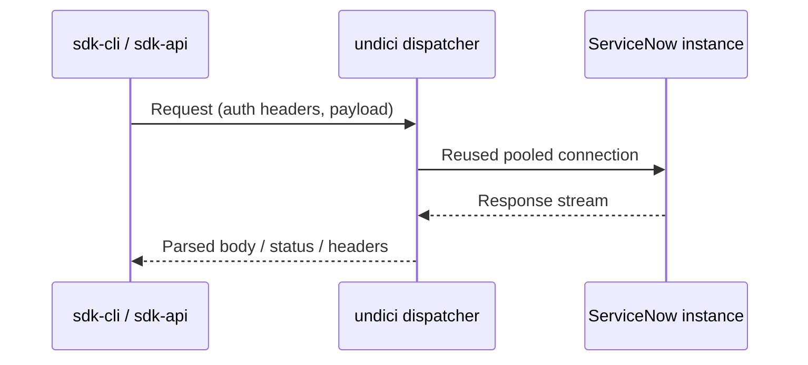

# Deep Dive: `undici` (v8.0.2)

`undici` is the HTTP transport library in modern Node.js ecosystems. In SDK contexts, it underpins high-throughput request dispatch, pooling, and Fetch-compatible semantics.

## Evidence Source (`npm pack`)

Captured from `npm pack undici` (tarball: `undici-8.0.2.tgz`):

- Name/version: `undici@8.0.2`
- Description: `An HTTP/1.1 client, written from scratch for Node.js`
- Main/types: `index.js`, `index.d.ts`
- Engines: `node >=22.19.0`
- Runtime dependencies: `0`
- Tarball layout highlights: `lib/` (115 entries), `types/` (46), `docs/` (42)

## Functioning Model

## Why It Matters for SDK Workloads

- Connection pooling improves repeated deployment operations.
- Fetch-compatible model simplifies higher-level SDK abstractions.
- Separate `types/` tree indicates first-class TypeScript usage.

## Source References

- `https://www.npmjs.com/package/undici`
- `npm pack undici`

## Tarball Evidence (from docs/npm-packs/extract)

- package.json highlights (undici-8.0.2/package/package.json):
  - `name: undici`
  - `version: 8.0.2`
  - `main: index.js`, `types: index.d.ts`
  - `engines.node: ">=22.19.0"`
  - `dependencies: {}` (no runtime deps)
  - rich scripts for build/test pipelines; TS definition tests via `tsd`
- dist layout highlights:
  - `lib/api/*`, `lib/core/*` — modular HTTP implementation
  - `types/*` — first-class TypeScript definitions

This confirms the zero-runtime-deps model, a modern Node.js engine requirement, and a strong TS-first API surface, aligning with its use as the SDK’s HTTP client.
